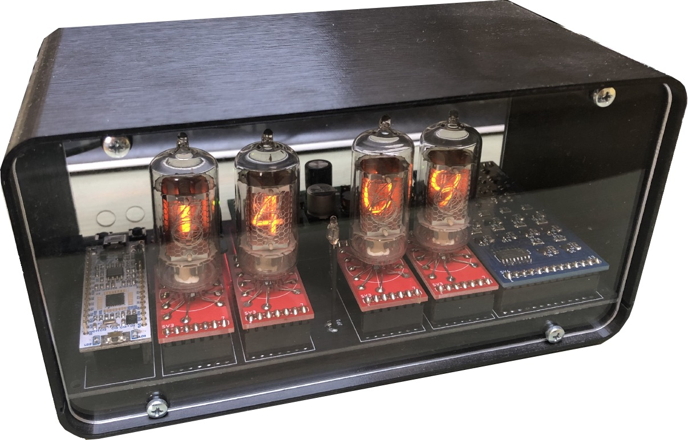
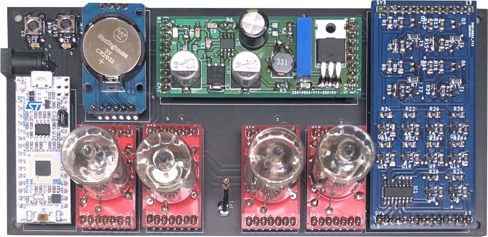
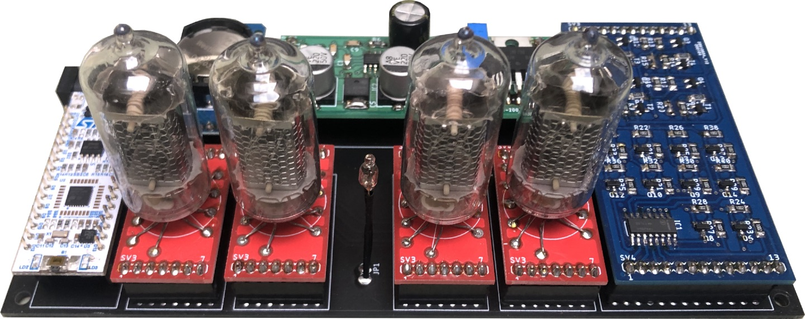

# Nixie-Clocks
Open-source nixie clocks project.

Final product

Top view

Overview

Slot-machine effect

### Modules to buy

[STM32L432KC](https://www.st.com/en/microcontrollers-microprocessors/stm32l432kc.html)

[DS3231 module](https://www.ebay.com/sch/i.html?_from=R40&_trksid=p2380057.m570.l1313&_nkw=DS3231&_sacat=0)

### Credits to

[Justin Jordan - DS3231 library](https://os.mbed.com/users/RCMISbed/code/ds3231//file/4e6e761c60f2/ds3231.cpp/)

[Dieter's Nixie Wolrd: Catode poisoning](http://www.tube-tester.com/sites/nixie/different/cathode%20poisoning/cathode-poisoning.htm)

[Power source schematic](http://elbastl.sweb.cz/hodiny.htm)
    